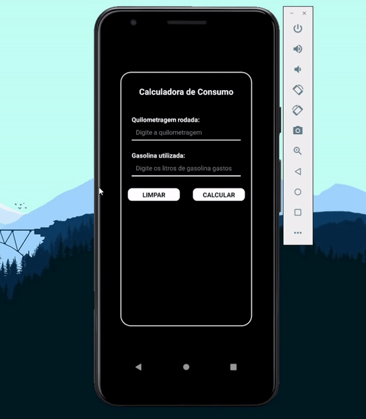

# Aplicativo TwoFootball

Aplicativo desenvolvido como trabalho para a disciplina de Tópicos Especiais em Computação. Desenvolvido em React Native utilizando o Expo, tem o objetivo de calcular o consumo médio de um automóvel, recebendo a distância percorrida e a gasolina gasta, e por fim mostrar a qual nível de consumo ele se encaixa:
    
- A: Mais de 12km/l 🟩⬛
- B: Até 12km/l 🟩
- C: Até 10km/l 🟨
- D: Até 8km/l 🟧 
- E: Até 4km/l 🟥

Demonstraçâo: 

